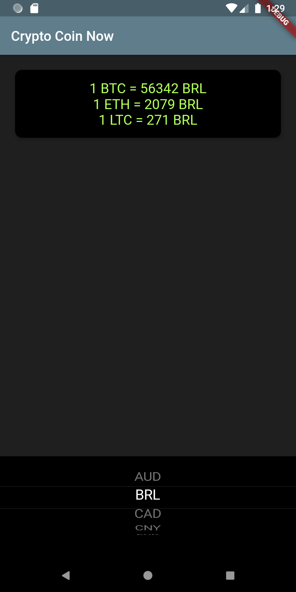

<h1>Crypto Coin Now</h1>

A simple application get the current rate of Crypto Currencies like BTC, ETH and LTC according to your country currency.
 
Learned from a course by  <a href="https://github.com/angelabauer"> Angela Yu</a>. Thanks to her. 
 

<h2> Download Android App - <a href="https://github.com/ismaan1998/crypto-coin-now/raw/master/app-release.apk">Click here</a></h2>
<h2> Screenshot-</h2> 

